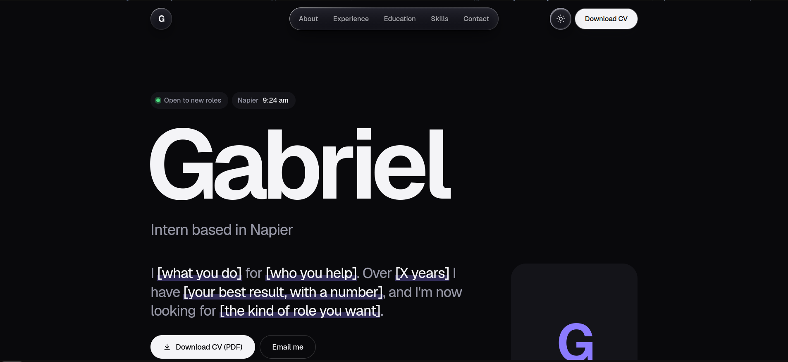

# Gabriel | CV Website

My personal CV as a website. It is a single page that gives recruiters and hiring managers what they need in under a minute: who I am, what I have done, what I can do, and how to reach me.



## What this project is for

A PDF CV is easy to send but easy to skip. This site is a link I can put in a job application, an email or a LinkedIn profile that shows the same information in a more memorable way, and that always stays up to date in one place.

It exists to:

- **Introduce me quickly.** The top of the page answers the questions a recruiter asks first: what I do, where I am based, my current role and when I am available.
- **Show my background clearly.** Experience, education and skills each have their own section, in the order employers look for them.
- **Make the next step easy.** A Download CV button, an email link and a copy-email button are always one click away.
- **Show that I can build things.** The site itself is a working example of my front-end skills, built by hand without frameworks or libraries.

## Who it is for

- **Recruiters and hiring managers** who want the key facts fast, on a phone or a laptop.
- **Anyone I share the link with**, such as lecturers, referees or contacts who want to see my background.
- **Me**, as a single place to keep my CV current and to practise web development.

## What is on the page

| Section | What it shows |
| --- | --- |
| **Hero** | My name, role, a short pitch, a download button, and four quick facts (current role, location, experience, availability) |
| **About** | A short professional summary |
| **Experience** | My work history, newest first, with achievements and tools used |
| **Education** | Degrees and courses |
| **Skills** | Core skills, tools and languages, with my strongest ones highlighted |
| **Contact** | Email, social links and a downloadable CV |

## Design

The goal was a clean, modern look that stays out of the way of the content.

- A floating glass-style navigation bar that follows you down the page and highlights the section you are in
- Light and dark modes that follow the visitor's system setting
- Smooth, subtle animations that respect the "reduce motion" setting
- A layout that works from phone to desktop
- A print layout, so "Print or save as PDF" produces a clean one-page-style CV

## Built with

Plain **HTML**, **CSS** and **JavaScript**. No frameworks, no build step and no dependencies. The only outside resource is the Geist font from Google Fonts, with a system font as a fallback.

## Project files

```
.
├── index.html    # content and structure
├── style.css     # design, animation and light/dark themes
├── cv.pdf        # the downloadable CV
└── photo.jpg     # optional portrait
```

## Run it

Open `index.html` in any browser. No install is needed.

## Use it as a template

You are welcome to adapt this for your own CV. Every place to edit is marked with an `EDIT` comment in `index.html`: your name, intro, jobs, education, skills and contact details. Colours are set at the top of `style.css`, and changing `--accent` recolours the whole site.

## Publish it

The easiest way is GitHub Pages:

1. Push these files to a GitHub repository.
2. Go to **Settings > Pages**.
3. Set **Source** to **Deploy from a branch**, choose `main` and the `/ (root)` folder, then save.
4. After a minute or two the site is live at `https://[your-username].github.io/[repository-name]/`.

## License

Released under the [MIT License](LICENSE). You are free to use, copy and adapt the code, including for your own CV site, as long as the copyright notice stays with it. This covers the code only: the personal details, text and photo are mine, so please replace them with your own.
